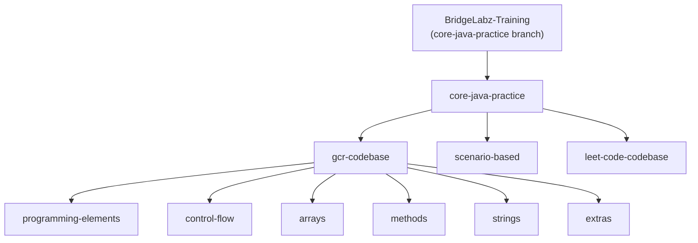

# 💻 BridgeLabz – Core Java Training

This repository captures my **Core Java learning journey** as part of the **BridgeLabz – Training Program**.  

All work is organized **chronologically(day-wise)** to clearly reflect progress, concepts learned, and hands-on practice.

---

## 🌿 Active Branch: `dsa-practice`

All current implementations, practice problems, and submissions are maintained in this branch.

---

## 📅 Week 1: Java Fundamentals Kickoff
---
### 📍 16/12/2025 (Tuesday)
🚀 Completed setup of **Java Development Kit (JDK)** and **IDE**.  
Gained understanding of the Java ecosystem, project structure, and program execution lifecycle.

🔗 **Setup & Configuration:**  [click-here](https://www.oracle.com/in/java/technologies/downloads/)

---

### 📍 17/12/2025 (Wednesday)
📝 Practiced introductory Java programs focusing on Java syntax, data types, input/output operations, and basic logic building.

🔗 **Programming Elements Practice:**  [click-here](https://github.com/BhaskarGautam24/BridgeLabz-Training/tree/core-java-practice/core-java-practice/gcr-codebase/programming-elements)

---

### 📍 18/12/2025 (Thursday)
📚 Completed and submitted **Level 1 & Level 2 Programming Elements** problems.  
Focused on Java documentation usage, problem-solving approach, and clean, structured code.

🔗 **Level 1 & 2 Solutions:**  [click-here](https://github.com/BhaskarGautam24/BridgeLabz-Training/tree/core-java-practice/core-java-practice/gcr-codebase/programming-elements)

---

### 📍 19/12/2025 (Friday)
⚡ Studied Java **Control Flow statements**, including if–else, switch-case, and looping constructs.  
Started solving **Level 1, Level 2, and Level 3** control flow problems.

🔗 **Control Flow Practice:**  [click-here](https://github.com/BhaskarGautam24/BridgeLabz-Training/tree/core-java-practice/core-java-practice/gcr-codebase/control-flows)

---

### 📍 20/12/2025 (Saturday)
🧠 Solved **scenario-based Core Java problems** applying real-world logic.  
Also studied **Arrays** and practiced array-based problem solving.

🔗 **Scenario-Based Problems:**  [click-here](https://github.com/BhaskarGautam24/BridgeLabz-Training/tree/core-java-practice/core-java-practice/scenario-based)  

🔗 **Array Practice:**  [click-here](https://github.com/BhaskarGautam24/BridgeLabz-Training/tree/core-java-practice/core-java-practice/gcr-codebase/arrays)

---
## 📅 Week 2:
---
### 📍 22/12/2025 (Monday)
🔍 Deep dive into **Methods and Strings**.  
Practiced modular programming, method reuse, and string manipulation concepts.

🔗 **Methods Practice:**  [click-here](https://github.com/BhaskarGautam24/BridgeLabz-Training/tree/core-java-practice/core-java-practice/gcr-codebase/methods)  

🔗 **Strings Practice:**  [click-here](https://github.com/BhaskarGautam24/BridgeLabz-Training/tree/core-java-practice/core-java-practice/gcr-codebase/strings)

---

### 📍 23/12/2025 (Tuesday)
✨ Solved advanced string problems and explored **built-in Java functions** for optimized coding and better readability.

🔗 **Extras & Built-in Functions:**  [click-here](https://github.com/BhaskarGautam24/BridgeLabz-Training/tree/core-java-practice/core-java-practice/gcr-codebase/extras)

---

## 🗂️ Repository Structure

---

### 📍 24/12/2025 (Wednesday)

📘 Started Object-Oriented Programming (OOPs) concepts in Core Java.
Practiced Classes & Objects and completed documentation and problems on Constructors, Instance vs Class Variables, and Access Modifiers.

🔗 **class and objects practice:**  [click-here](https://github.com/BhaskarGautam24/BridgeLabz-Training/tree/oops/oops/gcr-codebase/class-and-objects)

🔗 **constructors problems:**  [click-here](https://github.com/BhaskarGautam24/BridgeLabz-Training/tree/oops/oops/gcr-codebase/constructors)

---

### 📍 26/12/2025 (Friday)

📘 Completed and submitted Core Java keywords (this, static, final, instanceof) and studied Object-Oriented Design Principles (OODP) with practical understanding.
📝 All assigned tasks successfully completed.

🔗 **this, static, final key words and instanceof operator practice:** [click-here](https://github.com/BhaskarGautam24/BridgeLabz-Training/tree/oops-practice/oops-practice/gcr-codebase/this-static-finalkeywords-and-instanceofoperator)

🔗 **object oriented design principles practice:** [click-here](https://github.com/BhaskarGautam24/BridgeLabz-Training/tree/oops-practice/oops-practice/gcr-codebase/object-oriented-design-principles)

---

### 📍 27/12/2025 (Saturday)

📘 Studied Inheritance, Encapsulation, Interfaces, Abstract Classes, and Polymorphism in Core Java and practiced related problem statements.
📝 Conceptual understanding strengthened through hands-on problems.

🔗 **Inheritance practice:** [click-here](https://github.com/BhaskarGautam24/BridgeLabz-Training/tree/oops-practice/oops-practice/gcr-codebase/Inheritance)

🔗 **Encapsulation, Interfaces, Abstract Classes, and Polymorphism pratice:** [click-here](https://github.com/BhaskarGautam24/BridgeLabz-Training/tree/oops-practice/oops-practice/gcr-codebase/encapsulation-polymorphism-interface-and-abstract-class)

---

### 📍 29/12/2025 (Monday)

📘 Completed Linked List and Stack, Queue, HashMap, including Hash Function concepts, with hands-on problem practice.
📝 Improved problem-solving skills and understanding of real-world data handling using core data structures.

🔗 **Linked-List practice:** [click-here](https://github.com/BhaskarGautam24/BridgeLabz-Training/tree/dsa-practice/dsa-practice/gcr-codebase/Linked-List)

🔗 **Stack, queue and hashmap practice:** [click-here](https://github.com/BhaskarGautam24/BridgeLabz-Training/tree/dsa-practice/dsa-practice/gcr-codebase/stack-queue-hash)

---

### 📍 30/12/2025 (Tuesday)

📘 Studied sorting techniques and solved related practice problems, along with completing a scenario-based implementation using OOP principles.

🔗 **sorting practice:** [click-here](https://github.com/BhaskarGautam24/BridgeLabz-Training/tree/dsa-practice/dsa-practice/gcr-codebase/sorting-algorithms)

🔗 **oops scenario-based practice:** [click-here](https://github.com/BhaskarGautam24/BridgeLabz-Training/tree/oops-practice/oops-practice/scenario-based)

---

### 📍 31/12/2025 (Wednesday)

📘 Completed documentation and hands-on practice on Linear Search, Binary Search, StringBuilder, StringBuffer, BufferedReader, FileReader, and InputStreamReader.
📝 Enhanced efficiency in searching algorithms and effective handling of strings and input/output operations.

