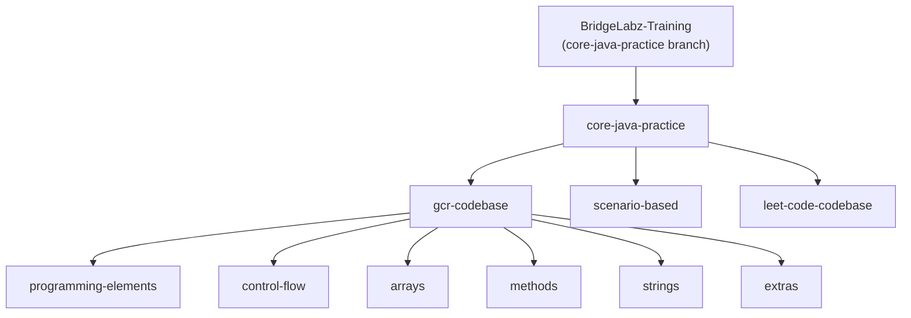
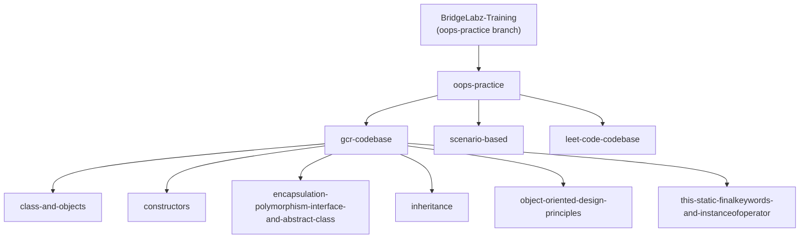
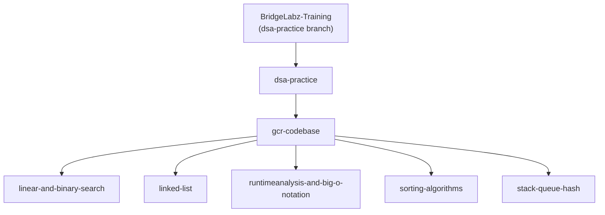

# 💻 BridgeLabz – Core Java Training

This repository captures my **Core Java learning journey** as part of the **BridgeLabz – Training Program**.  

All work is organized **chronologically(day-wise)** to clearly reflect progress, concepts learned, and hands-on practice.

---

## 🌿 Active Branch: `collections-practice`

All current implementations, practice problems, and submissions are maintained in this branch.

---

## 📅 Week 1: Java Fundamentals Kickoff
---
### 📍 16/12/2025 (Tuesday)
🚀 Completed setup of **Java Development Kit (JDK)** and **IDE**.  
Gained understanding of the Java ecosystem, project structure, and program execution lifecycle.

🔗 **Setup & Configuration:**  [click-here](https://www.oracle.com/in/java/technologies/downloads/)

---

### 📍 17/12/2025 (Wednesday)
📝 Practiced introductory Java programs focusing on Java syntax, data types, input/output operations, and basic logic building.

🔗 **Programming Elements Practice:**  [click-here](https://github.com/BhaskarGautam24/BridgeLabz-Training/tree/core-java-practice/core-java-practice/gcr-codebase/programming-elements)

---

### 📍 18/12/2025 (Thursday)
📚 Completed and submitted **Level 1 & Level 2 Programming Elements** problems.  
Focused on Java documentation usage, problem-solving approach, and clean, structured code.

🔗 **Level 1 & 2 Solutions:**  [click-here](https://github.com/BhaskarGautam24/BridgeLabz-Training/tree/core-java-practice/core-java-practice/gcr-codebase/programming-elements)

---

### 📍 19/12/2025 (Friday)
⚡ Studied Java **Control Flow statements**, including if–else, switch-case, and looping constructs.  
Started solving **Level 1, Level 2, and Level 3** control flow problems.

🔗 **Control Flow Practice:**  [click-here](https://github.com/BhaskarGautam24/BridgeLabz-Training/tree/core-java-practice/core-java-practice/gcr-codebase/control-flows)

---

### 📍 20/12/2025 (Saturday)
🧠 Solved **scenario-based Core Java problems** applying real-world logic.  
Also studied **Arrays** and practiced array-based problem solving.

🔗 **Scenario-Based Problems:**  [click-here](https://github.com/BhaskarGautam24/BridgeLabz-Training/tree/core-java-practice/core-java-practice/scenario-based)  

🔗 **Array Practice:**  [click-here](https://github.com/BhaskarGautam24/BridgeLabz-Training/tree/core-java-practice/core-java-practice/gcr-codebase/arrays)

---
## 📅 Week 2:
---
### 📍 22/12/2025 (Monday)
🔍 Deep dive into **Methods and Strings**.  
Practiced modular programming, method reuse, and string manipulation concepts.

🔗 **Methods Practice:**  [click-here](https://github.com/BhaskarGautam24/BridgeLabz-Training/tree/core-java-practice/core-java-practice/gcr-codebase/methods)  

🔗 **Strings Practice:**  [click-here](https://github.com/BhaskarGautam24/BridgeLabz-Training/tree/core-java-practice/core-java-practice/gcr-codebase/strings)

---

### 📍 23/12/2025 (Tuesday)
✨ Solved advanced string problems and explored **built-in Java functions** for optimized coding and better readability.

🔗 **Extras & Built-in Functions:**  [click-here](https://github.com/BhaskarGautam24/BridgeLabz-Training/tree/core-java-practice/core-java-practice/gcr-codebase/extras)

---

## 🗂️ core-java-practice(Branch Structure)

```mermaid
graph TD
    A["BridgeLabz-Training
(core-java-practice branch)"] --> B[core-java-practice]

    B --> C[gcr-codebase]

    C --> D[programming-elements]
    C --> E[control-flow]
    C --> F[arrays]
    C --> G[methods]
    C --> H[strings]
    C --> I[extras]

    B --> K[scenario-based]
    B --> L[leet-code-codebase]
```
---

### 📍 24/12/2025 (Wednesday)

📘 Started Object-Oriented Programming (OOPs) concepts in Core Java.
Practiced Classes & Objects and completed documentation and problems on Constructors, Instance vs Class Variables, and Access Modifiers.

🔗 **class and objects practice:**  [click-here](https://github.com/BhaskarGautam24/BridgeLabz-Training/tree/oops/oops/gcr-codebase/class-and-objects)

🔗 **constructors problems:**  [click-here](https://github.com/BhaskarGautam24/BridgeLabz-Training/tree/oops/oops/gcr-codebase/constructors)

---

### 📍 26/12/2025 (Friday)

📘 Completed and submitted Core Java keywords (this, static, final, instanceof) and studied Object-Oriented Design Principles (OODP) with practical understanding.

📝 All assigned tasks successfully completed.

🔗 **this, static, final key words and instanceof operator practice:** [click-here](https://github.com/BhaskarGautam24/BridgeLabz-Training/tree/oops-practice/oops-practice/gcr-codebase/this-static-finalkeywords-and-instanceofoperator)

🔗 **object oriented design principles practice:** [click-here](https://github.com/BhaskarGautam24/BridgeLabz-Training/tree/oops-practice/oops-practice/gcr-codebase/object-oriented-design-principles)

---

### 📍 27/12/2025 (Saturday)

📘 Studied Inheritance, Encapsulation, Interfaces, Abstract Classes, and Polymorphism in Core Java and practiced related problem statements.

📝 Conceptual understanding strengthened through hands-on problems.

🔗 **Inheritance practice:** [click-here](https://github.com/BhaskarGautam24/BridgeLabz-Training/tree/oops-practice/oops-practice/gcr-codebase/Inheritance)

🔗 **Encapsulation, Interfaces, Abstract Classes, and Polymorphism pratice:** [click-here](https://github.com/BhaskarGautam24/BridgeLabz-Training/tree/oops-practice/oops-practice/gcr-codebase/encapsulation-polymorphism-interface-and-abstract-class)

---

## 🗂️ oops-practice(Branch Structure)

```mermaid
graph TD
    A["BridgeLabz-Training
(oops-practice branch)"] --> B[oops-practice]

    B --> C[gcr-codebase]

    C --> D[class-and-objects]
    C --> E[constructors]
    C --> F[encapsulation-polymorphism-interface-and-abstract-class]
    C --> G[inheritance]
    C --> H[object-oriented-design-principles]
    C --> I[this-static-finalkeywords-and-instanceofoperator]

    B --> J[scenario-based]
    B --> K[leet-code-codebase]
```
---

### 📍 29/12/2025 (Monday)

📘 Completed Linked List and Stack, Queue, HashMap, including Hash Function concepts, with hands-on problem practice.

📝 Improved problem-solving skills and understanding of real-world data handling using core data structures.

🔗 **Linked-List practice:** [click-here](https://github.com/BhaskarGautam24/BridgeLabz-Training/tree/dsa-practice/dsa-practice/gcr-codebase/Linked-List)

🔗 **Stack, queue and hashmap practice:** [click-here](https://github.com/BhaskarGautam24/BridgeLabz-Training/tree/dsa-practice/dsa-practice/gcr-codebase/stack-queue-hash)

---

### 📍 30/12/2025 (Tuesday)

📘 Studied sorting techniques and solved related practice problems, along with completing a scenario-based implementation using OOP principles.

🔗 **sorting practice:** [click-here](https://github.com/BhaskarGautam24/BridgeLabz-Training/tree/dsa-practice/dsa-practice/gcr-codebase/sorting-algorithms)

🔗 **oops scenario-based practice:** [click-here](https://github.com/BhaskarGautam24/BridgeLabz-Training/tree/oops-practice/oops-practice/scenario-based)

---

### 📍 31/12/2025 (Wednesday)

📘 Completed documentation and hands-on practice on Linear Search, Binary Search, StringBuilder, StringBuffer, BufferedReader, FileReader, and InputStreamReader.

📝 Enhanced efficiency in searching algorithms and effective handling of strings and input/output operations.

---

### 📍 01/01/2026 (Thursday)

📘 Studied Runtime Analysis and Big-O Notation, covering time and space complexity concepts, best-case, average-case, and worst-case analysis with practical examples.

🔗 **Runtime Analysis and Big-O Notation practice:** [click-here](https://github.com/BhaskarGautam24/BridgeLabz-Training/tree/dsa-practice/dsa-practice/gcr-codebase/runtimeanalysis-and-big-o-notation)

---

## 🗂️ dsa-practice(Branch Structure)

```mermaid
graph TD
    A["BridgeLabz-Training
(dsa-practice branch)"] --> B[dsa-practice]

    B --> C[gcr-codebase]

    C --> D[linear-and-binary-search]
    C --> E[linked-list]
    C --> F[runtimeanalysis-and-big-o-notation]
    C --> G[sorting-algorithms]
    C --> H[stack-queue-hash]
```

---

### 📍 02/01/26 (Friday) and 03/01/26 (Saturday)

📘 Studied Java Generics, including generic classes, generic methods, type parameters, bounded types, and wildcards, along with hands-on practice problems.

📝 Improved understanding of type safety, code reusability, and how generics help in writing flexible and maintainable code.

🔗 **Generics Practice:** [click-here](https://github.com/BhaskarGautam24/BridgeLabz-Training/tree/collections-practice/collections-practice/gcr-codebase/generics)

---

### 📍 05/01/26 (Monday)

📘 Had my Review Session and completed review codes and pushed them in Review branch.

InterfaceVsAbstractDemo
StudentCourseRegistration
SwapTwoNumbers
exceptionalhandlingdividebyzero

🔗 **Review Problems:** [click-here](https://github.com/BhaskarGautam24/BridgeLabz-Training/tree/reviews/reviews)

---

### 📍 06/01/26 (Tuesday)

📘 Studied the Java Collection Framework, covering core interfaces and classes such as List, Set, Map, and their commonly used implementations, along with solving related practice questions.

🔗 **Collections Practice:** [click-here](https://github.com/BhaskarGautam24/BridgeLabz-Training/tree/collections-practice/collections-practice/gcr-codebase/collections)

---

### 📍 07/01/26 (Wednesday)

📘 Implemented Java Streams Question with File Input, File Output,Image Reader, copy, paste,etc method.

🔗 **Streams Practice:** [click-here](https://github.com/BhaskarGautam24/BridgeLabz-Training/tree/collections-practice/collections-practice/gcr-codebase/streams)

---

### 📍 08/01/26 (Thursday)

📘 Studied Exception Handling in Java in detail, including types of exceptions, try-catch blocks, multiple catch, finally, throw, and throws keywords.

📝 Gained a clear understanding of handling runtime errors effectively and writing robust, fault-tolerant programs.

---

### 📍 09/01/26 (Friday)

📘 Implemented multiple exception handling programs, covering real-world scenarios such as custom exceptions, input validation, and resource handling.

📝 Improved practical skills in identifying error-prone code and handling exceptions gracefully during program execution.

🔗 **Exceptional Handling Practice:** [click-here](https://github.com/BhaskarGautam24/BridgeLabz-Training/tree/collections-practice/collections-practice/gcr-codebase/exception-handling)

---

### 📍 10/01/26 (Saturday)

📘 Studied about Regular Expressions (Regex) 

---

### 📍 11/01/26 (Sunday)

📘 Studied about Junit

---

### 📍 12/01/26 (Monday)

📘 Implemented practice problems on Regex and JUnit, focusing on input validation scenarios and writing unit tests to verify application logic.

📝 Enhanced practical skills by combining pattern matching with automated testing to ensure correctness and code quality.

🔗 **Regex practice:** [click-here](https://github.com/BhaskarGautam24/BridgeLabz-Training/tree/collections-practice/collections-practice/gcr-codebase/regex)

🔗 **Junit practice:** [click-here](https://github.com/BhaskarGautam24/BridgeLabz-Training/tree/collections-practice/collections-practice/gcr-codebase/junit)

---

### 📍 13/01/26 (Monday) and 14/04/26 (Tuesday)

📘 Went through Java Annotations, including custom annotations and basic usage examples.

📘 Studied Java Reflection, covering class inspection, accessing fields and methods at runtime.

---

### 📍 15/01/2026 (Thursday) and 16/01/2026 (Friday)

📘 Implemented practice problems on Java Annotations, including creating custom annotations.

📝 Improved practical skills in marking classes/methods with annotations and accessing metadata dynamically.

🔗 **Annotations Practice:** [click-here](https://github.com/BhaskarGautam24/BridgeLabz-Training/tree/collections-practice/collections-practice/gcr-codebase/annotations)

🔗 **Reflection Practice:** [click-here](https://github.com/BhaskarGautam24/BridgeLabz-Training/tree/collections-practice/collections-practice/gcr-codebase/reflection)

---

